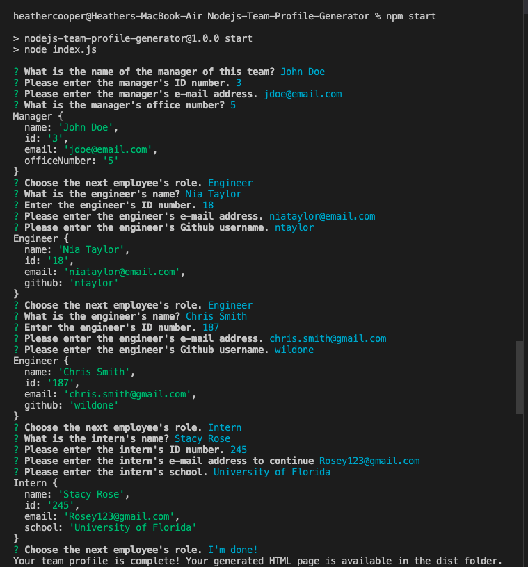

# Node.js Team Profile Generator

## Description
This is a Node.js command-line application that takes in information about a software engineering team's employees to generate an HTML webpage displaying summaries for each employee, including names, titles, email addresses and GitHub profile names.  The application will be unit-tested with Jest.

---

## How to Use:

- Navigate to the root of the project and enter the following on the command line:

  > npm start

- This will start the team profile generator, and you will be prompted to answer questions about the individual employees that you would like to generate a profile for. 

- Use the `up arrow` or `down arrow` on your keyboard to select `I'm done!`, and you will see the following message on the command line:

> Your team profile is complete! Your generated HTML page is available in the dist folder.

- You can view your generated team profile HTML page.

### Technology Used

- HTML/CSS
- Javascript
- Node.js
- Inquirer
- Jest
---

### Author

[cheribc](https://github.com/cheribc)

---
#### License

[MIT](https://opensource.org/licenses/MIT)